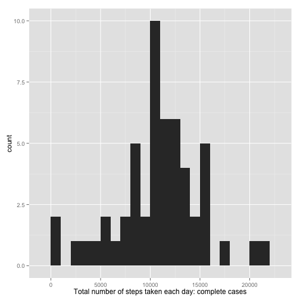
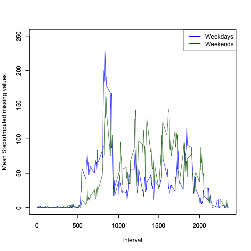
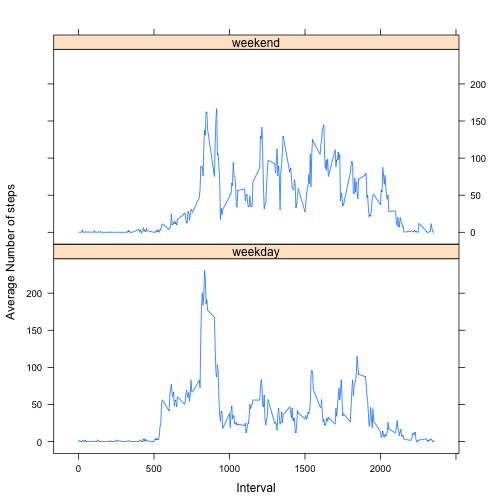

## Assignment 1
This is the report required in the first assignment of the 
Coursera Reproducible  course which is part of the Data Science specialization cetification path.

###Load required R libraries.

```r
require(dplyr)
```

```
## Loading required package: dplyr
## 
## Attaching package: 'dplyr'
## 
## The following objects are masked from 'package:stats':
## 
##     filter, lag
## 
## The following objects are masked from 'package:base':
## 
##     intersect, setdiff, setequal, union
```

```r
require(plyr)
```

```
## Loading required package: plyr
## -------------------------------------------------------------------------
## You have loaded plyr after dplyr - this is likely to cause problems.
## If you need functions from both plyr and dplyr, please load plyr first, then dplyr:
## library(plyr); library(dplyr)
## -------------------------------------------------------------------------
## 
## Attaching package: 'plyr'
## 
## The following objects are masked from 'package:dplyr':
## 
##     arrange, desc, failwith, id, mutate, summarise, summarize
```

```r
require(lubridate)
```

```
## Loading required package: lubridate
## 
## Attaching package: 'lubridate'
## 
## The following object is masked from 'package:plyr':
## 
##     here
```

```r
require(knitr)
require(chron)
```

```
## Loading required package: chron
## 
## Attaching package: 'chron'
## 
## The following objects are masked from 'package:lubridate':
## 
##     days, hours, minutes, seconds, years
```

```r
require(ggplot2)
```

```
## Loading required package: ggplot2
```
###Download, unzip and process the activity dataset. Read .csv file into dataframe.

```r
wd<-getwd()
destfile<-"activity.zip"
download.file("https://d396qusza40orc.cloudfront.net/repdata%2Fdata%2Factivity.zip",destfile,method="curl")
unzip(destfile)
activity<-read.csv("activity.csv")
```
### Remove missing observations for the time being and process the date
Now we want to remove the missing observations, i.e. the NA's

```r
act.complete.vector<-complete.cases(activity)
act.complete<-data.frame(activity[act.complete.vector,])
act.complete<-mutate(act.complete, date=ymd(date))
```
### What is mean total number of steps taken per day? 

For this part of the assignment, you can ignore the missing values in the dataset.

Make a histogram of the total number of steps taken each day

Calculate and report the mean and median total number of steps taken per day

First, split the dataframe to extract  steps per day.

The mean and median are reported in the graph


```r
op<-par()
options(warn=-1)
act.by.day<- ddply(act.complete, .(date), summarise,sum.steps=sum(steps,na.rm=TRUE))
act.by.day<-data.frame(act.by.day)
options(digits=2)
act.by.day$sum.steps<-as.numeric(act.by.day$sum.step)
mean.steps.day<-round(mean(act.by.day$sum.steps),digits=2)
median.steps.day<-round(median(act.by.day$sum.steps),digits=2)
mean.steps.chr<-as.character(mean.steps.day)
median.steps.chr<-as.character(median.steps.day)
l1<-paste("Mean Steps per day:", mean.steps.chr)
l2<-paste("Median Steps per day:",median.steps.chr)
par(font=1)
stats.txt<-rbind(l1,l2)
par(main.text=1)
hist(act.by.day$sum.steps,xlab="Steps per day",main=stats.txt)
```

 

```r
par(op)
```
###What is the average daily activity pattern?

Make a time series plot (i.e. type = "l") of the 5-minute interval (x-axis) and the average number of steps taken, averaged across all days (y-axis)

Which 5-minute interval, on average across all the days in the dataset, contains the maximum number of steps?

```r
options(warn=-1)
act.by.int<-ddply(act.complete,.(interval),summarise,mean.steps=mean(steps))
act.by.int<-data.frame(act.by.int)
y<-act.by.int$mean.steps
x<-act.by.int$interval
max.index<-which.max(act.by.int$mean.steps)
max.interval<-act.by.int[max.index,1]
max.int.chr<-as.character(max.interval)
legend.txt<-paste("Max Number of Steps at interval",max.int.chr)
#plot(act.by.int[,2]~act.by.int$interval,type="l")

y<-act.by.int$mean.steps
x<-act.by.int$interval
plot(y~x,type="l",
     xlab="Interval",ylab="Mean Steps per Interval")
abline(v=max.interval, col="red")
par(ps=12)
legend("topright",legend.txt,text.col="darkred")
```

 

```r
par(op)
options(warn=0)
```
###Imputing missing values

Note that there are a number of days/intervals where there are missing values (coded as NA). The presence of missing days may introduce bias into some calculations or summaries of the data.

Calculate and report the total number of missing values in the dataset (i.e. the total number of rows with NAs)

Devise a strategy for filling in all of the missing values in the dataset. The strategy does not need to be sophisticated. For example, you could use the mean/median for that day, or the mean for that 5-minute interval, etc.

The strategy was to first design a function ,imput.na().  which would replace the missing values with the interval average.

Create a new dataset that is equal to the original dataset but with the missing data filled in.

Make a histogram of the total number of steps taken each day and Calculate and report the mean and median total number of steps taken per day. Do these values differ from the estimates from the first part of the assignment? What is the impact of imputing missing data on the estimates of the total daily number of steps?

Two histograms were produced along the the means and medians of the with both NA's dropped and imputed.
There is very little difference in the means and medians.
Note that the total number of steps per day increased at the peak of the histogram with the missing steps imputed by using the mean.  This is to be expected, as n increased by including the missing points.

The the values of n for both files are reported along with the number of missing values.


```r
impute.na <- function(x) replace(x, is.na(x), mean(x, na.rm = TRUE))
act.impute <- data.frame(ddply(activity, ~interval, transform, steps = impute.na(steps)))
act.impute<-data.frame(act.impute[order(act.impute$date,act.impute$interval),])
total.steps <- tapply(act.complete$steps, act.complete$date, FUN=sum)
qplot(total.steps, binwidth=1000, xlab="Total number of steps taken each day: complete cases")
```

 

```r
mean.steps<-round(mean(total.steps),digits=2)
median.steps<-round(median(total.steps),digits=2)
mean.steps.chr<-as.character(mean.steps)
median.steps.chr<-as.character(median.steps)
total.steps.imputed <- tapply(act.impute$steps, act.impute$date, FUN=sum)
qplot(total.steps.imputed, binwidth=1000, xlab="Total number of steps taken each day: imputed")
```

 

```r
mean.steps.imputed<-round(mean(total.steps.imputed),digits=2)
median.steps.imputed<-round(median(total.steps.imputed),digits=2)
mean.steps.imp.chr<-as.character(mean.steps.imputed)
median.steps.imp.chr<-as.character(median.steps.imputed)
#col.headers<-c("type","mean steps", "median steps")
r1<-c("missing NA's", mean.steps.chr,median.steps.chr)
r2<-c("imputed values",mean.steps.imp.chr,median.steps.imp.chr )
comp.table<-data.frame(rbind(r1,r2))
#names(comp.table<-col.headers) 
names(comp.table)[1]<-"Missing NA/Imputed"
names(comp.table)[2]<-"Mean"
names(comp.table)[3]<-"Median"
row.names(comp.table)<-NULL
print(comp.table)
```

```
##   Missing NA/Imputed     Mean   Median
## 1       missing NA's 10766.19    10765
## 2     imputed values 10766.19 10766.19
```

```r
ncomplete<-nrow(act.complete)
nimpute<-nrow(act.impute)
nc.s<-as.character(ncomplete)
ni.s<-as.character(nimpute)
dif<-nimpute-ncomplete
tot.na.s<-as.character(dif)
l1<-paste("With with missing values excluded: n=" ,nc.s)
l2<-paste("With missing values imputed, n=",ni.s)
l3<-paste("Total incomplete cases =", tot.na.s)
text.lines<-rbind(l1,l2,l3)
print(text.lines)
```

```
##    [,1]                                         
## l1 "With with missing values excluded: n= 15264"
## l2 "With missing values imputed, n= 17568"      
## l3 "Total incomplete cases = 2304"
```
###Are there differences in activity patterns between weekdays and weekends?

For this part the weekdays() function may be of some help here. Use the dataset with the filled-in missing values for this part.

Create a new factor variable in the dataset with two levels – “weekday” and “weekend” indicating whether a given date is a weekday or weekend day.

Make a panel plot containing a time series plot (i.e. type = "l") of the 5-minute interval (x-axis) and the average number of steps taken, averaged across all weekday days or weekend days (y-axis). The plot should look something like the following, which was creating using simulated data:

Your plot will look different from the one above because you will be using the activity monitor data. Note that the above plot was made using the lattice system but you can make the same version of the plot using any plotting system you choose.
               
####Notes (Please read):  
Also produced a single plot of weekend vs. weekday activity for additional clarity and for experience 
The panel plots are produced below as required.
Reformated date using format(date,%A)
Introduced factors rather than using the weekday function 
I had attempted to use the weekend function in chron but thought it easier just to introduce the factors directly.

```r
act.impute$weekend<-is.weekend(act.impute$date)
act.impute.wkend<-ddply(act.impute,.(weekend,interval),summarise,mean.steps=mean(steps))
act.impute.weekday<-data.frame(act.impute.wkend[!act.impute.wkend$weekend,])
act.impute.weekend<-data.frame(act.impute.wkend[act.impute.wkend$weekend,])
y<-act.impute.weekday$mean.steps
z<-act.impute.weekend$mean.steps
options(warn=-1)
#legend.txt<-paste("Maximum Number of Steps at interval",max.imp.chr)
op<-par()
plot(y~x,type="l",col="blue",ylim=c(0,250),ylab="",xlab="")
par(new=TRUE)
plot(z~x,type="l",col="darkgreen",ylim=c(0,250),ylab="Mean Steps(Imputed missing values",xlab="Interval")
legend("topright", # places a legend at the appropriate place 
       # puts text in the legend 
       c("Weekdays","Weekends"),
       lty=c(1,1), # gives the legend appropriate symbols (lines)
       col=c("blue","darkgreen"),
       lwd=c(2.5,2.5) # gives the legend lines the correct color and width
)
```

 

```r
wkday <- function (wknd) {
  if(wknd) {day<-"Weekend"}
  else {day<-"Weekday"}
return(day)
}
act.impute$date1 <- format(as.Date(act.impute$date), "%A")
act.impute$weekdays <- factor(act.impute$date1)
levels(act.impute$weekdays)
```

```
## [1] "Friday"    "Monday"    "Saturday"  "Sunday"    "Thursday"  "Tuesday"  
## [7] "Wednesday"
```

```r
levels(act.impute$weekdays) <- list(weekday = c("Monday", "Tuesday",
                                             "Wednesday", 
                                             "Thursday", "Friday"),
                                 weekend = c("Saturday", "Sunday"))
levels(act.impute$weekdays)
```

```
## [1] "weekday" "weekend"
```

```r
table(act.impute$weekdays)
```

```
## 
## weekday weekend 
##   12960    4608
```

```r
mean.steps.impute <- aggregate(act.impute$steps, 
                      list(interval = as.numeric(as.character(act.impute$interval)), 
                           weekdays = act.impute$weekdays),
                      FUN = "mean")
names(mean.steps.impute)[3] <- "mean.steps"
library(lattice)
xyplot(mean.steps.impute$mean.steps ~ mean.steps.impute$interval | mean.steps.impute$weekdays, 
       layout = c(1, 2), type = "l", 
       xlab = "Interval", ylab = "Average Number of steps")
```

 
